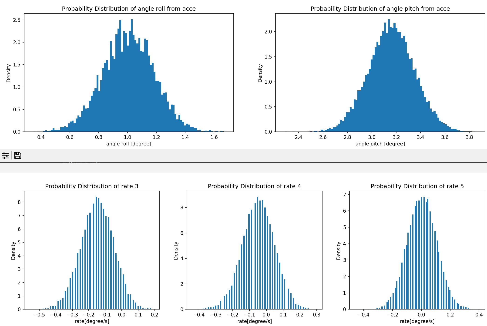

# MPU6050

- calibration(find average offset)
- 3D-KF(acceleration+gyroscope)
  

# GY521(HMC5883L+QMC5883L)

-calibration(elipsoid fitting)
- 3D-KF(magnetometer+gyroscope)

# BMP280

- 2D-KF(acceleration+barometer)
